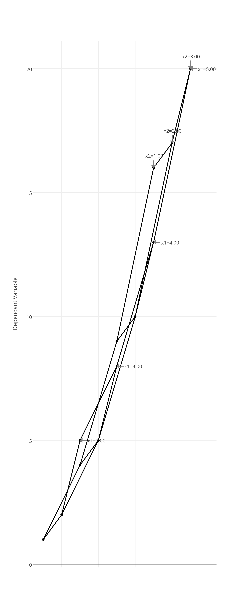

 CarpetPlot
============

Library of Python functions to generate carpet plots

**Author**: Stephen Andrews
			<www.aircraftdesign.ca>
			<>

**Acknowledgements**: This library is heavily based on the matlab functions provided by Dr. McDonals in Ref. 1.

Dependencies
------------

* numpy
* plotly

References
----------

1. McDonald, Rob. "Carpet Plot Toolkit". <http://www.mathworks.com/matlabcentral/fileexchange/40831-carpet-plot-toolkit>
2. Powers, S. A.. "Generation of Carpet Plots". <http://www.dept.aoe.vt.edu/~mason/Mason_f/SD1CarpetsbySAP.pdf>

Carpet Plot Basics
------------------

A carpet plot displays the relationship between two independent variables and one dependant variable. In these plots, the abscissa uses an arbitrary scale which distorts the individual relationships between each independent variable and the dependant variable. The advantage of this plot is that combinations of the two independent variables which yield a desired dependant variable value are easy to identify.

Each line on the carpet plot represents a variation of one independent variable while the other is maintained constant. Each of these iso-lines is labelled with the corresponding value of the independent variable which is held constant.

To Do
-----

- Give user greater control for placement of curve labels
- Allow constraint lines to be added to carpet plot 
- Streamline generation of three DOF plots

Examples
--------

Thee example plots are contained in the examples directory

2_indep_1_dep.py
----------------

This example shows a carpet plot of two a dependant variable against two independent variables x1 and x2. Two different choices of offset are shown. The choice of offset is difficult to determine *a priori* but can be modified to ensure that the grid is nicely spaced.

